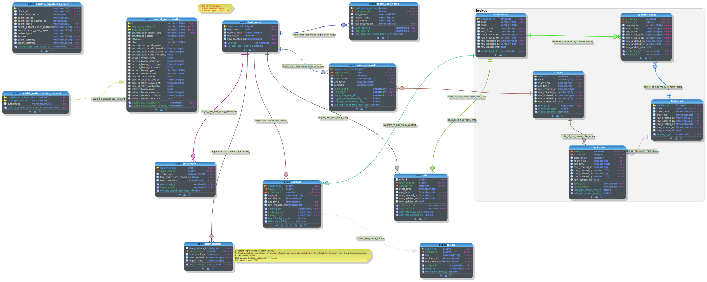

# OAuth (New - 2.1) Authorization server

This repository full documentation can be found at [m-thirumal.github.io/oauth-authorization-server/](https://m-thirumal.github.io/oauth-authorization-server/)

#### What is Authentication and Authorization?

`Authentication` - "Who you are?", is the process of ascertaining that somebody really is who they claim to be.

`Authorization` refers to rules that determine who is allowed to do what. E.g. Thirumal may be authorized to create and delete databases, while Jesicca is only authorized to read.


#### There are many ways of authentication, few of which are worth discussing here:

   1. `Knowledge-based authentication`: The username password combination is a type of knowledge-based authentication. The idea is to verify the user based on the knowledge of the user for example answer to security questions, passwords, something which only the user should know.
   
   
   2. `Possession based authentication`: This type of authentication is based on verifying something which a user possesses. For example, when an application sends you One Time Passwords (OTPs) or a text message.

   Modern authentication practices use a combination of both types, also known as `Multi-Factor authentication`.

## OAuth2 grant types

OAuth2 supports several grant types for different use cases. The most common grant types are:

| Grant Type                           |    Usage
|--------------------------------------|
| Authorization Code                   | Used for web applications that run on a server and need to access resources on behalf of a user.
| Implicit                             | Used for single-page applications that run in a web browser and need access to resources without the need for a server.
| Resource Owner Password Credentials  | Used for trusted applications that require direct access to a user’s resources.
| Client Credentials                   |  Used for applications that need to access their own resources.

## Features:

| Configuration Parameter                                                                     | EndPoints                               | 
|---------------------------------------------------------------------------------------------|-----------------------------------------|
| issuer (Base URL)                                                                           | http://localhost:9000                   |
| authorization_endpoint                                                                      | http://localhost:9000/oauth2/authorize  |
| [Access Token](https://m-thirumal.github.io/oauth-authorization-server/Access%20Token/)     | http://localhost:9000/oauth2/token      |
| [Refresh Token](https://m-thirumal.github.io/oauth-authorization-server/Refresh%20Token/)   | http://localhost:9000/oauth2/token      |
| [Revoke Token](https://m-thirumal.github.io/oauth-authorization-server/Revoke%20Token/)     | http://localhost:9000/oauth2/revoke     |
| jwks_uri                                                                                    | http://localhost:9000/oauth2/jwks       |
| userinfo_endpoint                                                                           | http://localhost:9000/userinfo          |
| [Introspect Token](https://m-thirumal.github.io/oauth-authorization-server/Introspect/)     | http://localhost:9000/oauth2/introspect |
| [EndPoints](https://m-thirumal.github.io/oauth-authorization-server/EndPoints/)             | http://localhost:9000/.well-known/openid-configuration|
| [Customize Token Content](https://m-thirumal.github.io/oauth-authorization-server/Customize%20Access%20Token%20Content/)|    -      |
| [DDL SQL for PostgreSQL](./docs/authorization.sql)                                          | DDL for PostgreSQL                      |
| [Data Dictionary of Model](./docs/data%20dictionary.html)                                   | [DB](./docs/data%20dictionary.html)     |


## Prerequisites:

1. [Eureka](https://github.com/m-thirumal/eureka-server) (Optional)
2. PostgreSQL 

## Set UP

Documentation to set up can be [found here](docs/Set%20up.md)


## Database model




## [FAQ](https://m-thirumal.github.io/oauth-authorization-server/FAQ)

1. Where do I find all end points. Invoke [http://localhost:9000/.well-known/openid-configuration](http://localhost:9000/.well-known/openid-configuration)

```
{
    "issuer": "http://localhost:9000",
    "authorization_endpoint": "http://localhost:9000/oauth2/authorize",
    "token_endpoint": "http://localhost:9000/oauth2/token",
    "token_endpoint_auth_methods_supported": [
        "client_secret_basic",
        "client_secret_post",
        "client_secret_jwt",
        "private_key_jwt"
    ],
    "jwks_uri": "http://localhost:9000/oauth2/jwks",
    "userinfo_endpoint": "http://localhost:9000/userinfo",
    "response_types_supported": [
        "code"
    ],
    "grant_types_supported": [
        "authorization_code",
        "client_credentials",
        "refresh_token"
    ],
    "revocation_endpoint": "http://localhost:9000/oauth2/revoke",
    "revocation_endpoint_auth_methods_supported": [
        "client_secret_basic",
        "client_secret_post",
        "client_secret_jwt",
        "private_key_jwt"
    ],
    "introspection_endpoint": "http://localhost:9000/oauth2/introspect",
    "introspection_endpoint_auth_methods_supported": [
        "client_secret_basic",
        "client_secret_post",
        "client_secret_jwt",
        "private_key_jwt"
    ],
    "subject_types_supported": [
        "public"
    ],
    "id_token_signing_alg_values_supported": [
        "RS256"
    ],
    "scopes_supported": [
        "openid"
    ]
}

```


### Login

[](http://127.0.0.1:9000/oauth2/authorize?response_type=code&client_id=client1&redirect_uri=http://127.0.0.1:9000/authorized&scope=openid%20read)

## Recovery Code


## Multi factor authentication

* Authentication App

* Text message (SMS)

* Security Key

* Recovery Code
	When the use lost the phone / authenticator app mobile
