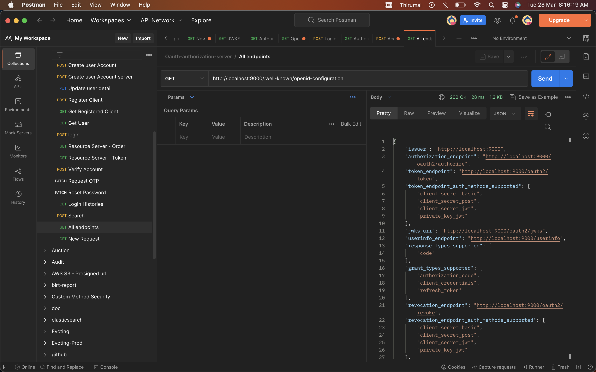

# All End points

Invoke [http://localhost:9000/.well-known/openid-configuration](http://localhost:9000/.well-known/openid-configuration)

```bash
{
    "issuer": "http://localhost:9000",
    "authorization_endpoint": "http://localhost:9000/oauth2/authorize",
    "token_endpoint": "http://localhost:9000/oauth2/token",
    "token_endpoint_auth_methods_supported": [
        "client_secret_basic",
        "client_secret_post",
        "client_secret_jwt",
        "private_key_jwt"
    ],
    "jwks_uri": "http://localhost:9000/oauth2/jwks",
    "userinfo_endpoint": "http://localhost:9000/userinfo",
    "response_types_supported": [
        "code"
    ],
    "grant_types_supported": [
        "authorization_code",
        "client_credentials",
        "refresh_token"
    ],
    "revocation_endpoint": "http://localhost:9000/oauth2/revoke",
    "revocation_endpoint_auth_methods_supported": [
        "client_secret_basic",
        "client_secret_post",
        "client_secret_jwt",
        "private_key_jwt"
    ],
    "introspection_endpoint": "http://localhost:9000/oauth2/introspect",
    "introspection_endpoint_auth_methods_supported": [
        "client_secret_basic",
        "client_secret_post",
        "client_secret_jwt",
        "private_key_jwt"
    ],
    "subject_types_supported": [
        "public"
    ],
    "id_token_signing_alg_values_supported": [
        "RS256"
    ],
    "scopes_supported": [
        "openid"
    ]
}

```




