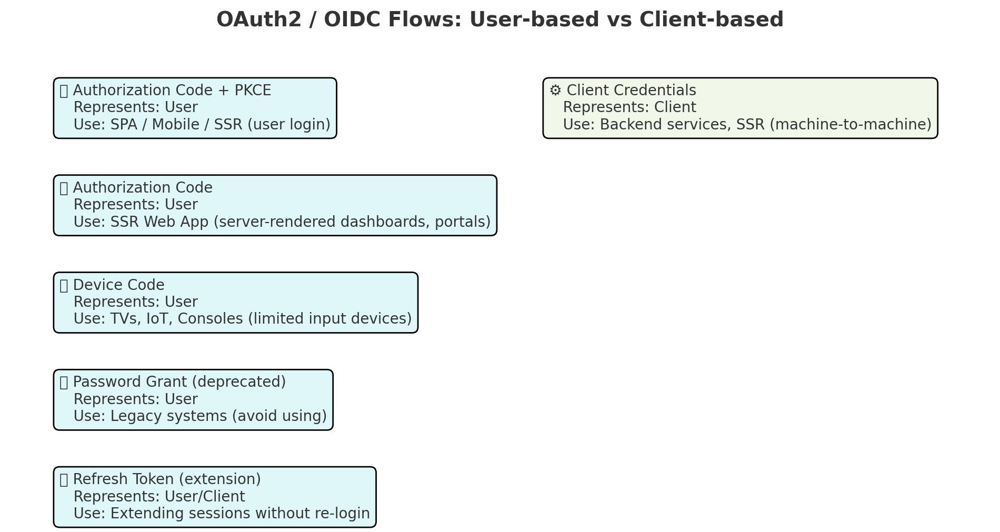

# Registered Client

`ClientId` and `ClientSecret` are credentials that the OAuth Client application will use to authenticate with the server. 

| Type of Client                                   | Grant / Flow Type                            | Represents                        | When to Use                                                                                                 |
| ------------------------------------------------ | -------------------------------------------- | --------------------------------- | ----------------------------------------------------------------------------------------------------------- |
| SPA (Single Page App, public)                | Authorization Code + PKCE                | User                          | Browser-based apps where code runs client-side (React, Angular, Vue). Secure since no client secret needed. |
| Mobile App (public)                          | Authorization Code + PKCE                | User                          | Native iOS / Android apps. Same reasons as SPA, PKCE ensures security.                                      |
| SSR Web App (Confidential)                   | Authorization Code (with secret or PKCE) | User                          | Web apps that render on the server and need to know which user is logged in (e.g., dashboards, portals).    |
| SSR Web App (Confidential)                   | Client Credentials                       | Client (App itself)           | Server-side apps making machine-to-machine API calls, cron jobs, background tasks. No user involved.        |
| Backend Service / API Gateway (Confidential) | Client Credentials                       | Client                        | Service-to-service communication (e.g., API Gateway → Microservice).                                        |
| IoT / Smart TV / Console App (Public)        | Device Code Flow                         | User                          | Devices with limited input (TVs, IoT). User logs in on a separate browser/device.                           |
| Legacy Apps                                  | Password Grant ❌ (Deprecated)            | User                          | Directly exchanging username/password. Insecure — avoid.                                                    |
| Any Client                                   | Refresh Token Flow (extension)           | Same as original (User or Client) | Extend sessions without re-login. Typically combined with Authorization Code or Device Code.                |

| Clien type         | Github repository for the Demo or to  Implemented                                  |
|--------------------|------------------------------------------------------------------------------------|
| PKCE               | [UI demo for authorization service](https://github.com/m-thirumal/auth-service-ui) |
| Client Credentials | |
