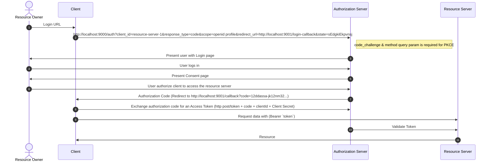

# OAuth 2 Authorization server

## What is OAuth 2?

OAuth means `Open Authorization` & OAuth 2 is an  `Authorization Framework`

#### What is Authentication and Authorization?

`Authentication` - "Who you are?", is the process of ascertaining that somebody really is who they claim to be.

`Authorization` refers to rules that determine who is allowed to do what. E.g. Thirumal may be authorized to create and delete databases, while Jesicca is only authorized to read.

#### [Database](./database.md)


#### There are many ways of authentication, few of which are worth discussing here:

   1. `Knowledge-based authentication`: The username password combination is a type of knowledge-based authentication. The idea is to verify the user based on the knowledge of the user for example answer to security questions, passwords, something which only the user should know.
   
   
   2. `Possession based authentication`: This type of authentication is based on verifying something which a user possesses. For example, when an application sends you One Time Passwords (OTPs) or a text message.

   Modern authentication practices use a combination of both types, also known as `Multi-Factor authentication`.
   
## Prerequisites:

1. [Eureka](https://github.com/m-thirumal/eureka-server) - Optional
2. PostgreSQL 


## [How to set up](Set up.md)

1. Without [Eureka](https://github.com/m-thirumal/eureka-server). Comment `eureka-client` in `pom.xml`.
2. 


* [Definition](Definitions.md)



### SQL

```
INSERT INTO public.oauth2_authorization_consent(
	registered_client_id, principal_name, authorities)
	VALUES ('Thirumal', 'admin', 'user');
```

### Database model


## FAQ

1. Where do I find all end points. Invoke [http://localhost:9000/.well-known/openid-configuration](http://localhost:9000/.well-known/openid-configuration)

```
{
    "issuer": "http://localhost:9000",
    "authorization_endpoint": "http://localhost:9000/oauth2/authorize",
    "token_endpoint": "http://localhost:9000/oauth2/token",
    "token_endpoint_auth_methods_supported": [
        "client_secret_basic",
        "client_secret_post",
        "client_secret_jwt",
        "private_key_jwt"
    ],
    "jwks_uri": "http://localhost:9000/oauth2/jwks",
    "userinfo_endpoint": "http://localhost:9000/userinfo",
    "response_types_supported": [
        "code"
    ],
    "grant_types_supported": [
        "authorization_code",
        "client_credentials",
        "refresh_token"
    ],
    "revocation_endpoint": "http://localhost:9000/oauth2/revoke",
    "revocation_endpoint_auth_methods_supported": [
        "client_secret_basic",
        "client_secret_post",
        "client_secret_jwt",
        "private_key_jwt"
    ],
    "introspection_endpoint": "http://localhost:9000/oauth2/introspect",
    "introspection_endpoint_auth_methods_supported": [
        "client_secret_basic",
        "client_secret_post",
        "client_secret_jwt",
        "private_key_jwt"
    ],
    "subject_types_supported": [
        "public"
    ],
    "id_token_signing_alg_values_supported": [
        "RS256"
    ],
    "scopes_supported": [
        "openid"
    ]
}

```
#### Acquire Authorization Code

1. Login using URL: [http://localhost:9000](http://localhost:9000/login)

2. To get Authorization Token: [http://localhost:9000/oauth2/authorize?response_type=code&client_id=client1&redirect_uri=http://127.0.0.1:8000/authorized&scope=read](http://localhost:9000/oauth2/authorize?response_type=code&client_id=client1&redirect_uri=http://127.0.0.1:8000/authorized&scope=read)


